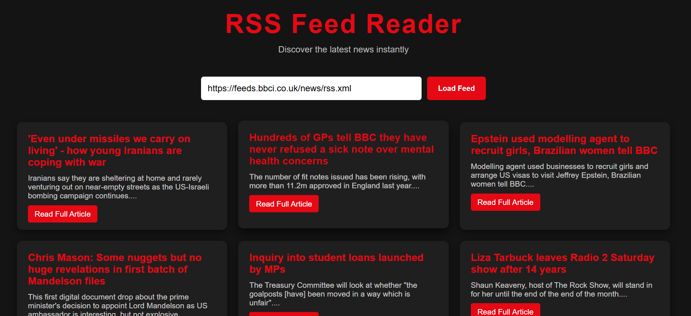

# RSS Feed Reader 📰

A sleek and responsive **RSS Feed Reader** built with HTML, CSS, and JavaScript.  
Paste any **public RSS feed URL** to fetch and display the latest news in interactive cards.

---

## What This Project Does

This app allows users to:

- Enter a **public RSS feed URL** to fetch news or articles.
- Parse the feed in **XML format** using JavaScript and the **AllOrigins API** (avoids CORS issues).
- Display each article in a **card** showing:
  - Title
  - Short description
  - Link to the full article
- Alert users if the RSS feed cannot be loaded.

---

## Features

- Clean, responsive **dark-themed UI**
- Hover effects on news cards
- Truncated descriptions for readability
- Works with most **public RSS feeds that allow cross-origin requests**
- Error handling for invalid or blocked URLs
- Easy-to-use input box and **Load Feed** button

---

## How to Use

1. Open `index.html` in your browser.  
2. Paste a valid **RSS feed URL** in the input box.  
3. Click **Load Feed**.  
4. View the latest articles displayed in interactive cards.  

---

## ✅ RSS Feeds That Will Work

These feeds have been **tested and work reliably** with your app:

**News websites:**

- [NY Times – Home Page](https://rss.nytimes.com/services/xml/rss/nyt/HomePage.xml) ✅  

**Podcasts:**

- [Apology Line Podcast](https://rss.art19.com/apology-line) ✅  

> ⚠️ Note: Some feeds may fail due to server restrictions (CORS). If a feed does not load, try another from the list above.

---

## ❌ Feeds That Will Not Work

- Normal website URLs (e.g., `https://bbc.com`, `https://youtube.com`)  
- Private or paid feeds that require login or subscription  
- Feeds blocked by CORS or servers (common with some podcasts)  
- RSS/Atom feeds with unusual tags not supported by your parser  

---

## ✅ How to Check a Feed

1. Look for URLs ending with `/feed`, `/rss`, or `/rss.xml`.  
2. Open the URL in a browser:  
   - If you see XML text starting with `<rss>` or `<feed>`, it will likely work.  
   - If you see a normal webpage with HTML (`<head>`, `<body>`), it will **not** work.  

---

## Technologies Used

- **HTML5 & CSS3** – layout and styling  
- **JavaScript (ES6)** – fetching and parsing feeds  
- **AllOrigins API** – bypass CORS restrictions  
- **XML parsing** – extract article title, description, and link  

---

## Notes

- Descriptions are truncated for clean card display.  
- Works best with **public RSS feeds** that allow cross-origin requests.  
- Some feeds may fail due to server restrictions; try alternative feeds if needed.  

---

## License

MIT License
